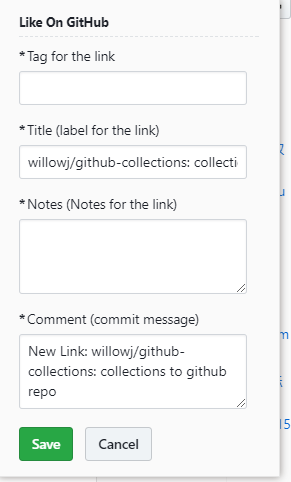

##  Like on GitHub  [example](https://github.com/willowj/github-collections)
> Chrome extension to save any note or link to github repo modified from [Idnan](https://github.com/Idnan/like-on-github)

collect any interesting link or note to github repo

- feature
  - with mouse select text as cite
  - caratory by tag
  - can add notes

### Installation

- download the extension and [load it manually](http://superuser.com/questions/247651/how-does-one-install-an-extension-for-chrome-browser-from-the-local-file-system/247654#247654) 

### Setup

- First things first, create a repository to which you would want the links to the liked content be added

- Now add a file e.g. README.md. This is the file that will be holding your likes and you'll have to provide it while setting up the options in the step below.

- Right click the extension icon (thumb icon) in the bar and click the options page

- At the options page, add the specified details

  

  options page notice:

  ​	username ,repo, file path must be  correct, 

  ​	commiter name and email with not null  will be ok.

- Make sure to select the `repo` option while generating token.

  

- Voila! You are all set.

### How to Use

1. select text with mouse  (optional)
2. press CTR + Shift + L ; A window will open where you can edit the link title and commit message. 
3.  verify  input options 
4. click save and link will be saved in your GitHub repository.

 

- **input options explain ** :

    tag : default as `collect` ,in title auto to upcase;  

    title : default as web title

    notes : default as ` `

    commit meesage: default  as "new link to github repo" from commiter you set

  

  mouse selected text  is hidden ,you can inspect css-selector `.logh input[name="cite"]`

### tips : eat with following better

-  [chrome-github-mate](https://github.com/rubyerme/chrome-github-mate) : add toc on the right

#### Contributions

Feel free to share, fork, enhance, create PRs or lock issues.

#### License

MIT &copy; [Adnan Ahmed](http://github.com/idnan)

